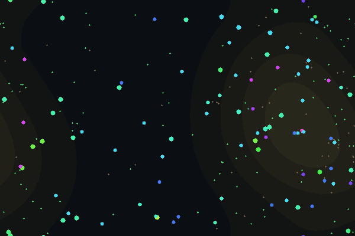

# vivere

[](https://github.com/skelinn/vivere/actions/workflows/ci.yml)
[](LICENSE)
[](docs/DESIGN.md#determinism)

> *vivere* (Latin): to live.

**vivere is an attempt to create life digitally — not to imitate it, but to build worlds where it can arise. We start with physics that conserves energy, add heredity and mutation, and let selection do the rest.**

Imitation is the trap this project is built to avoid. A simulated ant that follows an ant-behavior script is a puppet; nothing about it is alive, and nothing about it can surprise you. vivere goes the other way: build a small universe with honest physics — energy that is never created or destroyed, bodies that cost what they're made of, inheritance that errs — and then get out of the way. If something in that world feeds itself, outruns its costs, and leaves descendants, it is doing so because the world permits it, not because we told it to. The organisms owe us nothing, and that's the point: whatever survives is *real* survival, whatever evolves is *real* evolution, discovered rather than designed.


*Before: seed 42 at generation ~600 — slow, large, long-lived grazers clustered where the light grows food. Colors are heritable lineage markers.*


*After: the same unbroken lineage at generation ~6,300, one million ticks after contact physics arrived and predation was invented (red flashes are bites landing). Fewer, faster organisms — and three times the standing food. Nobody programmed either world; they grew.*

```sh
# sixty seconds to a living world
git clone https://github.com/skelinn/vivere && cd vivere
make run        # watch a fresh world evolve, live

# or download eden.snap from the v0.2.0 release — 6,000 generations of
# evolved pacifists — and release the teeth into it yourself:
cargo run --release -p vivere-cli -- run --resume eden.snap --override-contact true --ticks 1000000 --out invasion.csv
```

## Principles

- **Nothing is scripted.** No fitness function, no hand-written behaviors, no spawn quotas keeping populations comfortable. Organisms live or die by what the world does to them.
- **Energy is conserved.** It enters only as sunlight growing food, leaves only as metabolic heat, and the books are audited every tick (`world_energy + radiated == injected`, asserted in tests and debug builds). Conservation is what makes selection honest: every ability has a price, so nothing evolves for free.
- **Bodies are tradeoffs, not stats.** Bigger stores more energy but burns more; speed costs quadratically; longevity and brains have upkeep. The genome chooses a point in that space and the world grades the choice.
- **Determinism is a feature.** Same seed + same commit = same run, byte for byte. Every interesting moment is reproducible, sharable as a snapshot, and debuggable.
- **The instrument panel matters as much as the world.** Evolution you can't measure is an anecdote. Every run logs population, energy, genome size, diversity, and trait drift to CSV.

## Why not just add features?

Because features are ceilings and physics are floors. Every behavior we hand-write is a behavior that can never evolve, surprise us, or be selected against — a hard-coded "flee predators" routine forecloses the discovery of hiding, herding, armor, or bluffing. Every unconserved resource is a subsidy with no price, and selection can't price what's free. The discipline of this project is to grow the *world* — richer chemistry, more physical channels for interaction — and let organisms discover what those channels are for. When vivere gains predation, it won't be an `attack()` feature; it will be physics that makes other organisms' energy reachable, and whatever follows from that.

## v0.1 — "protocell"

A 2D continuous wraparound world. Uneven sunlight grows food; organisms sense (nearest food and neighbor, own energy, age, noise, an oscillator), think with a small evolvable recurrent net (biosim4-style connection genes + body genes for size, speed, metabolism, lifespan, color), and act (turn, thrust). Eating on contact and division above an energy threshold are reflexes — protocells don't decide. Corpses become detritus, which composts back into food. Death comes from starvation or old age, nothing else. Reproduction is asexual with point mutations, connection add/remove, and gene duplication.

In v0.1 evolution has exactly two things to work with: steering (the brain) and body-plan economics (the genes). That's deliberate — a small, closed, measurable loop, honest all the way down.

## v0.2 — "contact"

Bodies are now physically reachable energy to each other. A third brain output — bite, continuous effort exactly like thrust — drains a touching neighbor within the attacker's front arc. Firing costs a lunge whether or not anything is in reach; flesh transfers at 75% efficiency (the rest is heat); kills leave corpses that compost like any other body, so scavenging needed no new code. Nothing decides *for* an organism whether the channel is worth using: predation, parasitism, defense, kin-sparing, and mimicry are all just wiring that evolutionary search may or may not find. Three appended senses support whatever arms race follows — relative neighbor size, signed hue difference (kin discrimination: hue finally has consequences without gaining physics of its own), and `drain_felt`, the interoceptive *I am being eaten*.

The gene walls also moved: v0.1 populations pinned four of five body genes against their range limits, so ranges widened ~2.5×, speed capacity now carries idle upkeep (unused muscle decays out of populations), and scale genes mutate multiplicatively in log space, reflecting at the walls. Old worlds can cross over: `vivere import-v01` carries a v0.1 snapshot into v0.2 physics — quarantined, or with the teeth on.

## Field notes

Nothing below was programmed; all of it grew — and every claim reproduces from a seed and a commit (metrics CSVs and world snapshots ship with each release).

- **Succession** ([v0.1.0](https://github.com/skelinn/vivere/releases/tag/v0.1.0)): the founding boom selected fast, hot-metabolism, short-lived foragers; the mature grazed-down world reversed every one of those traits by generation ~600 — r→K succession from nothing but conserved energy and mutation.
- **Honest costs move walls** ([v0.2.0](https://github.com/skelinn/vivere/releases/tag/v0.2.0)): the moment idle muscle carried upkeep, the speed gene fell off the ceiling it had sat against for thousands of generations, and size crossed its old wall within decades of generations. Cost curves, not clamps, are what shape bodies.
- **Predation was invented, not installed** ([v0.2.0](https://github.com/skelinn/vivere/releases/tag/v0.2.0)): given contact physics and genomes with *zero* aggression wiring, a 6,000-generation pacifist ecosystem discovered biting, quadrupled its brains to the genome cap, crashed from 375 to 61 organisms, survived, and left the meadows three times fuller — a trophic cascade in a terrarium. The next binding wall is neural: [#10](https://github.com/skelinn/vivere/issues/10).

## Quickstart

```sh
git clone https://github.com/skelinn/vivere
cd vivere

# native viewer (pause/step/speed, click an organism to inspect it)
make run

# headless run: 50k ticks, metrics every 100 ticks
make sim SEED=42 TICKS=50000 OUT=runs/seed42.csv

# the CLI directly
cargo run --release -p vivere-cli -- run --seed 42 --ticks 100000 --out run.csv
cargo run --release -p vivere-cli -- run --seed 42 --ticks 50000 --save-snapshot runs/w.snap
cargo run --release -p vivere-cli -- run --resume runs/w.snap --ticks 50000   # continue
cargo run --release -p vivere-cli -- default-config > my.toml                 # edit, then --config my.toml

make test   # determinism, conservation, snapshot exactness
make lint   # fmt + clippy
```

Viewer controls: `space` pause · `.` step · `+`/`-` speed · mouse wheel zoom · right-drag pan · click inspect · `R` refit · `esc` deselect.

## Reading a run

The CSV logs, per window: `population`, `births`, `deaths_starve`/`deaths_age`, `mean_energy`/`max_energy`, `mean_genome_len`, `diversity` (mean pairwise genome distance over a sample), body-gene means (`mean_size`, `mean_speed_gene`, `mean_metab`, `mean_max_age`), `mean_actual_speed`, `mean_generation`, `food_count`, `detritus_count`, and the energy ledger (`world_energy`, `injected`, `radiated`, `drift` — drift should be ~1e-12 of total, i.e., zero).

Expectation-setting: a 50k-tick run is *early* evolution — some tens of generations. Selection acts on foraging, body economics, and (since v0.2) the contact channel. Boom-and-bust population dynamics are normal for a fresh biosphere, contact worlds are *expected* to be more volatile than grazing worlds, and trait drift may be subtle. That's a finding, not a bug.

## Roadmap

Each step grows the world, not the feature list. Order is intent, not promise.

- **v0.1 — protocell**: conserved energy, evolvable steering, asexual heredity, full instrumentation.
- **v0.2 — contact** (this): bodies as reachable energy — the bite/defense/kin channels, wider gene walls, the v0.1 importer.
- **v0.3 — chemistry or sex**: multiple resource types with evolvable metabolic pathways, or crossover and mate choice — whichever the worlds make more urgent.
- **v0.4 — multicellularity**: bodies as cell collectives; development as part of the genome.
- **Beyond**: GPU compute for 10⁶-organism worlds, WASM/browser builds, and alternate substrates (e.g., continuous-CA worlds à la Lenia) behind the same sense→think→act seam — see [docs/DESIGN.md](docs/DESIGN.md).

## Contributing

See [CONTRIBUTING.md](CONTRIBUTING.md). The two house rules: keep energy conserved (every joule traceable) and keep runs deterministic (no unseeded randomness, no iteration-order surprises). Feature proposals get one question: *is it physics, or is it a script?*

## License

[MIT](LICENSE).
